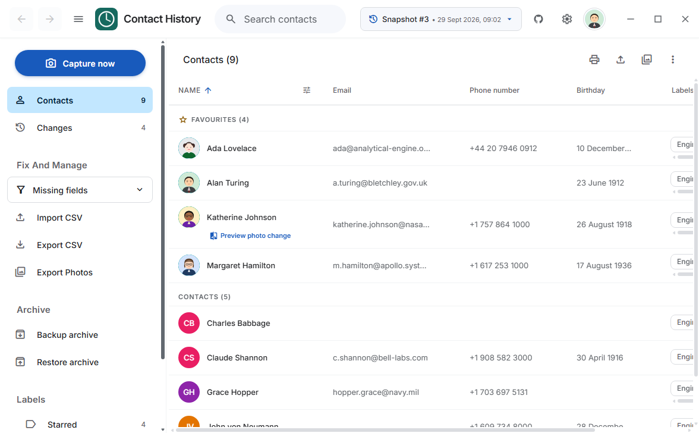
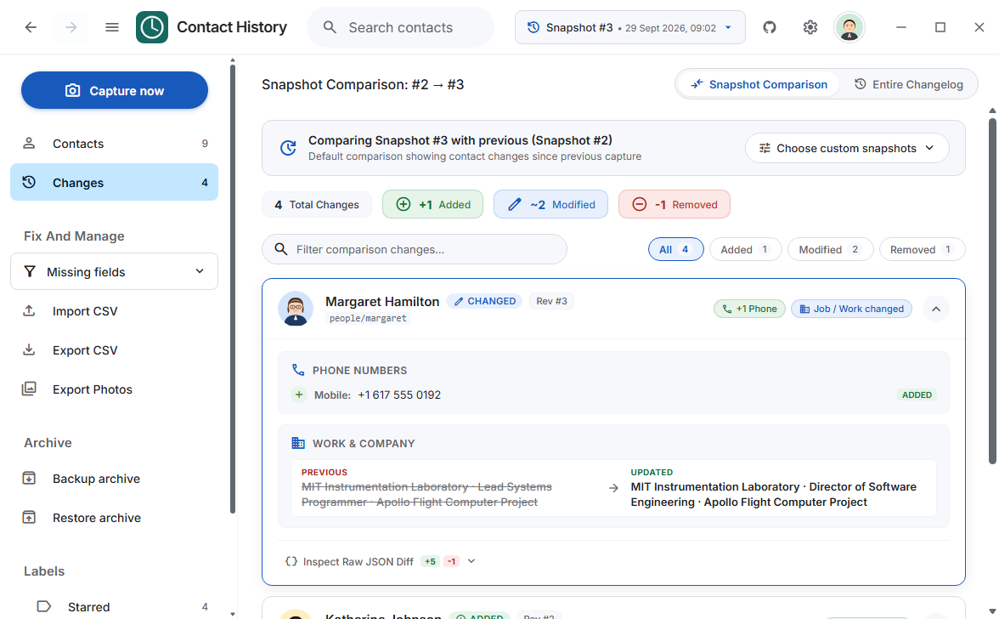
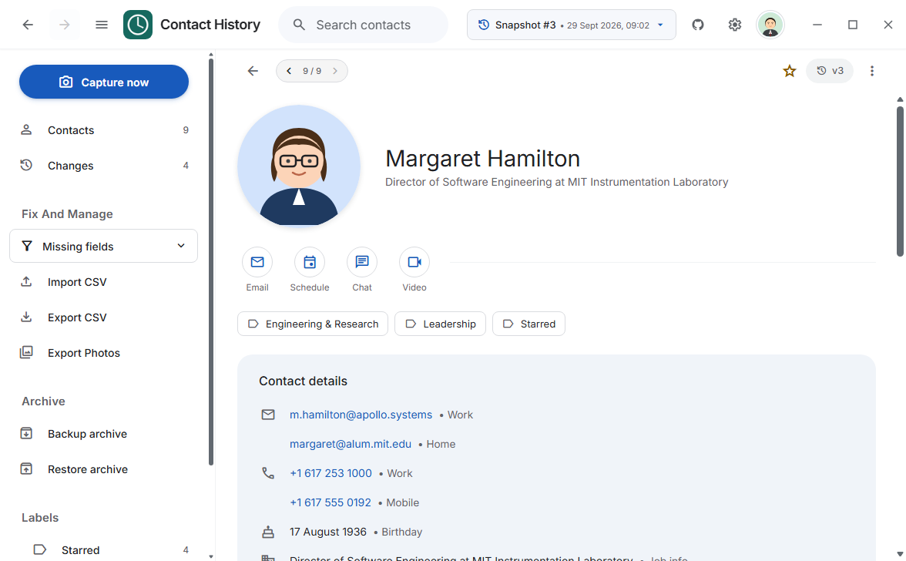
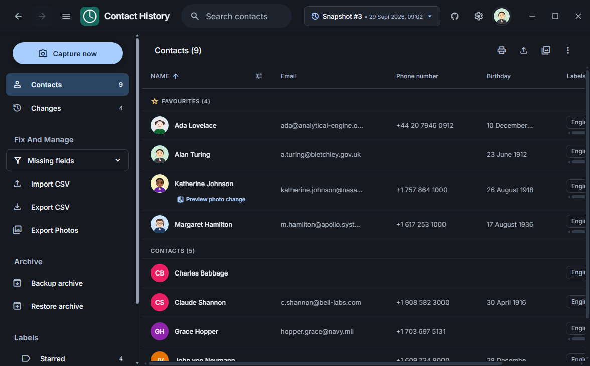
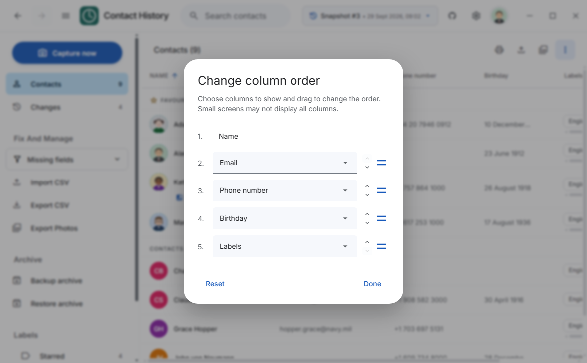
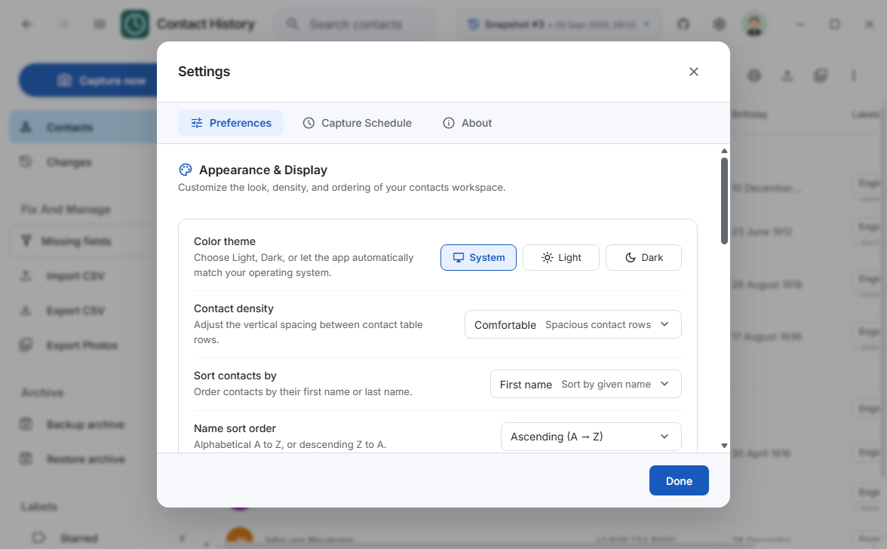

# Contact History

[](https://github.com/NotToxel/ContactHistory)
[](https://v2.tauri.app)
[](https://svelte.dev)
[](https://www.rust-lang.org)
[](https://bun.sh)
[](LICENSE)

A Windows-first, offline-first desktop archive and visual diff utility for Google Contacts. Contact History continuously captures point-in-time snapshots, detects field-by-field modifications, archives original high-resolution photo bytes, provides forensic rollback comparison, and exports to standard formats—without ever requesting write permissions to your Google account.

---

## Visual Showcase

<div align="center">

### Main Contacts Workspace

*Configurable contact table with sortable columns, label filtering, search, and snapshot time-travel.*

<br/>

### Field-Level Visual Diff Engine

*Side-by-side and inline visual diffing highlighting additions, modifications, and removals across snapshots.*

<br/>

### Contact Profile Inspector

*Deep contact inspection with multiple emails/phones, formatted birthdays, custom fields, and snapshot provenance.*

<br/>

### Native Dark Theme

*Complete dark mode support adhering to system preferences or manual customization.*

<br/>

### Column Customizer & Settings
| Column Customization | Preferences & Schedules |
| :---: | :---: |
|  |  |
| *Reorderable, selectable table column slots.* | *Capture schedules, theme, and archive tools.* |

</div>

---

## Why Contact History?

Google Contacts provides cloud synchronization across mobile devices and the web, but it lacks revision history, point-in-time snapshots, and audit trails. When contacts are accidentally edited, merged incorrectly, truncated by third-party sync apps, or silently deleted, Google offers only a blunt "Undo changes" feature limited to 30 days that rewrites your entire contact database.

**Contact History** solves this:
- **Immutable Snapshots**: Captures complete historical states in an isolated SQLite database per account.
- **Granular Visual Diffing**: Shows exactly which fields changed (phone numbers, emails, addresses, job titles, photos, notes) between any two arbitrary captures.
- **True Read-Only Peace of Mind**: Connects strictly with `contacts.readonly` scope using OAuth 2.0 PKCE. It is technically impossible for the application to modify or delete contacts on Google's servers.
- **Offline First**: All data lives on your PC under `%APPDATA%\ContactHistory`. Full search, browsing, diffing, and export work without an internet connection.
- **Media Preservation**: Fetches and stores exact original photo bytes with automatic retry and SHA-256 deduplication.

---

## Key Features

### 🛡️ Read-Only Security & Credential Isolation
- Uses Google OAuth 2.0 with PKCE and a local loopback callback.
- Scopes requested: `openid`, `email`, and `contacts.readonly`. Never requests contact-write scopes.
- Refresh tokens are encrypted and held in Windows Credential Manager via the native `keyring` crate.
- Account databases and configuration are stored locally with zero remote telemetry.

### ⏱️ Snapshot & Delta Capture Engine
- Efficient initial scan followed by Google People API sync-token delta updates.
- Captures contacts, user groups, system labels, birthdays, relations, addresses, and user-defined custom fields.
- Snapshot sequences allow time-traveling back to any previously captured date.
- Delete or manage individual snapshots while preserving remaining historical revisions.

### 🔍 Forensic Change Detection & Visual Diffs
- Field-level diff engine categorizes additions (green), modifications (amber), and deletions (red).
- Visual pill badges highlight modified phone numbers, emails, jobs, birthdays, notes, and avatars.
- Expandable change cards reveal granular before/after diffs with JSON patch export for auditing.
- Compare any two arbitrary snapshots (e.g. Earliest vs. Latest, or custom revision pairs).

### 🗃️ Flexible Data Management & Productivity
- **Customizable Columns**: Reorder and toggle table columns (Name, Email, Phone, Birthday, Organization, Job Title, Labels, Addresses).
- **Missing Fields Auditor**: Instantly filter contacts lacking photos, birthdays, phone numbers, or email addresses.
- **International Phone Formatting**: Integrated `libphonenumber-js` formatting and system locale detection.
- **Fast Search**: Typo-tolerant, accent-insensitive search across names, emails, phones, notes, and company names.
- **Print & PDF Generation**: Clean printable directory views filtered by label or selection.

### 📦 Export & Portability
- **Google CSV**: Export capture state directly into RFC 4180 Google Contacts CSV format for easy migration.
- **vCard 3.0**: Standard `.vcf` export with embedded photos and UTF-8 multi-field encoding.
- **Batch Photo Export**: Extract high-resolution contact photos to a directory or a standalone `.zip` archive.
- **`.contacthistory` Archive Backup & Restore**: Self-contained container backups with SQLite database, media files, and SHA-256 manifest validation.

### ⏰ Automated Background Sync
- Optional integration with **Windows Task Scheduler** for daily and logon capture checks.
- Headless CLI mode (`capture --due`) checks elapsed time (7-day default interval) and syncs in the background without UI overhead.

---

## Reusable Screenshot Generation

Contact History includes an automated screenshot pipeline that launches a headless browser, initializes a mock snapshot environment with rich historical data, navigates through all key views, and captures production-ready assets:

```powershell
bun run screenshots
```

The script (`scripts/generate-screenshots.ts`):
1. Compiles the frontend assets into `dist/`.
2. Spins up a native Bun static web server.
3. Launches Microsoft Edge (or Google Chrome) in headless mode via Chrome DevTools Protocol (CDP).
4. Injects realistic mock data (contacts, snapshots, changes, avatars, and labels).
5. Automatically cycles through light mode, contact details, expanded diffs, settings dialogs, column customizer, dark mode, and onboarding.
6. Saves timestamped, optimized PNGs into `docs/screenshots/`.

---

## Installation & Development

### Prerequisites
- [Bun](https://bun.sh) (v1.1+)
- [Rust & Cargo](https://www.rust-lang.org) (MSVC toolchain)
- Windows 10/11 with WebView2 Runtime (pre-installed on modern Windows)

> [!IMPORTANT]
> This project strictly uses **Bun**. Do not use npm, npx, yarn, or pnpm.

### Setup & Run
```powershell
# Install frontend dependencies
bun install

# Run desktop application in development mode
bun run tauri dev
```

### Quality & Verification
```powershell
# Run frontend unit tests (Bun test runner)
bun run test

# Run Rust backend test suite
bun run test:rust

# TypeScript and Svelte syntax validation
bun run check

# Format frontend code
bun run format

# Build production bundle
bun run build
```

---

## Google Cloud OAuth Setup

To connect a Google account:

1. Open the [Google Cloud Console](https://console.cloud.google.com/).
2. Create a new project (e.g. `Contact History Archive`).
3. Under **APIs & Services** > **Library**, search for and enable the **Google People API**.
4. Configure the **OAuth consent screen**:
   - User Type: **External** (or Internal for Google Workspace organizations).
   - Scopes: Add `.../auth/contacts.readonly`, `.../auth/userinfo.email`, and `openid`.
5. Under **Credentials**, click **Create Credentials** > **OAuth client ID**:
   - Application type: **Desktop app**.
   - Name: `Contact History Desktop Client`.
6. Copy the generated **Client ID** and **Client Secret**.
7. Launch Contact History, paste the credentials into the **Connect Google** screen, and authorize via your browser.

---

## CLI & Headless Reference

Contact History compiles to a dual-mode native executable supporting GUI and CLI commands:

```powershell
# Run automated due capture in headless mode (scheduled task target)
contact-history.exe capture --due

# Create a full portable backup of an account archive
contact-history.exe backup <account-uuid> C:\Backups\account.contacthistory

# Restore a .contacthistory archive into a new local account ID
contact-history.exe restore C:\Backups\account.contacthistory

# Export a specific capture sequence to CSV or vCard
contact-history.exe export <account-uuid> <sequence> csv C:\Backups\contacts.csv
contact-history.exe export <account-uuid> <sequence> vcf C:\Backups\contacts.vcf

# Import synthetic fixture files for offline testing
bun run native import-fixture tests\fixtures\capture-1.json fixture-demo demo@example.test
bun run native import-fixture tests\fixtures\capture-2.json fixture-demo demo@example.test
```

---

## Storage & Security Architecture

| Item | Location / Implementation | Description |
| :--- | :--- | :--- |
| **Account Metadata** | `%APPDATA%\ContactHistory\accounts.json` | Non-sensitive account list and display profiles |
| **Account Databases** | `%APPDATA%\ContactHistory\accounts\<UUID>\archive.db` | Independent SQLite database per account |
| **Media Cache** | `%APPDATA%\ContactHistory\accounts\<UUID>\media\` | Cached contact photo bytes with SHA-256 file keys |
| **OAuth Credentials** | Windows Credential Manager (`keyring`) | Client secret and refresh tokens encrypted by Windows DPAPI |
| **Task Schedule** | Windows Task Scheduler (`schtasks`) | Per-user background trigger for headless sync |

---

## Disclaimers & Legal Notice

### Google LLC Trademark & Service Disclaimer
> [!NOTE]
> **Contact History is an independent open-source project and is NOT affiliated with, sponsored by, authorized by, or endorsed by Google LLC or Alphabet Inc.**
> "Google", "Google Contacts", "Google Cloud", and related trademarks and logos are the property of Google LLC. All API usage adheres to the [Google API Services User Data Policy](https://developers.google.com/terms/api-services-user-data-policy).

### Data Privacy & Security Notice
> [!IMPORTANT]
> - All contact data, snapshots, profile photos, and credentials reside **exclusively on your local machine**.
> - The application does **NOT** transmit telemetry, error reports, or contact records to any third-party server or developer endpoint.
> - The application operates strictly with **read-only** Google API permissions (`contacts.readonly`). It does not have technical permission to create, edit, or delete contacts in your Google account.
> - Users are solely responsible for protecting their local backup files (`.contacthistory`) and safeguarding their device access.

### Software Warranty & As-Is Notice
> [!CAUTION]
> This software is provided by the copyright holders and contributors "AS IS" and any express or implied warranties, including, but not limited to, the implied warranties of merchantability and fitness for a particular purpose are disclaimed. In no event shall the authors or contributors be liable for any direct, indirect, incidental, special, exemplary, or consequential damages arising in any way out of the use of this software (as stated in Section 15 and 16 of the GNU Affero General Public License v3.0).

---

## License

This project is licensed under the [GNU Affero General Public License v3.0](LICENSE) (AGPL-3.0).
